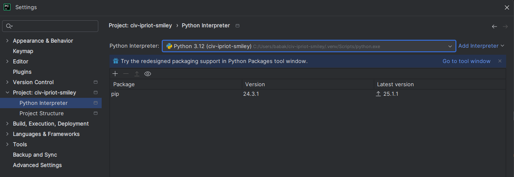
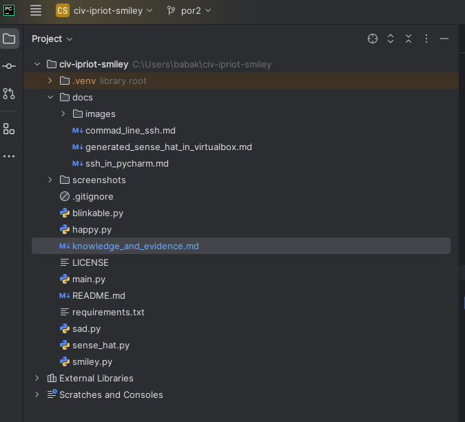
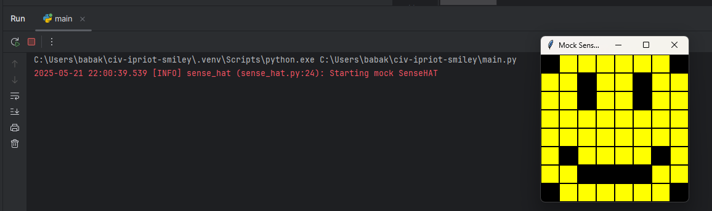
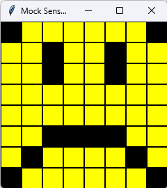
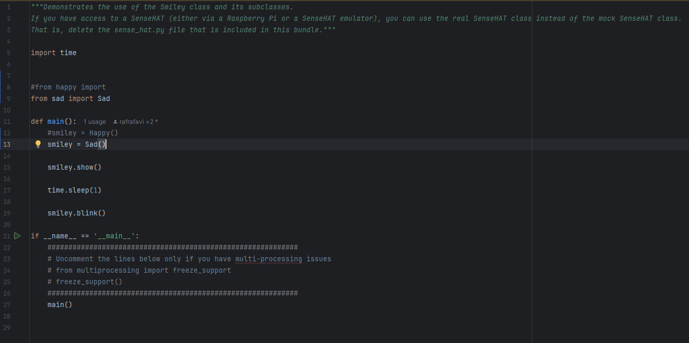
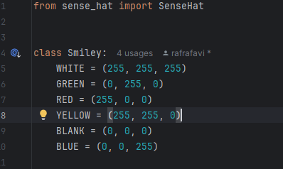
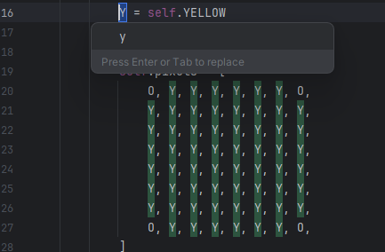
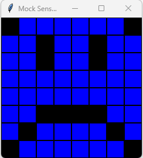
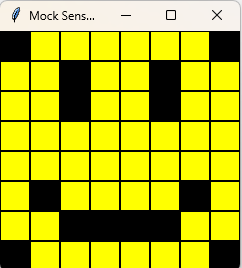
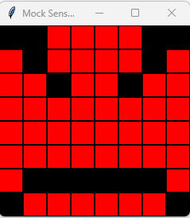

# Evidence and Knowledge

This document includes instructions and knowledge questions that must be completed to receive a *Competent* grade on this portfolio task.

## 1. Required evidence

### 1.1. Answer all questions in this document

- Each answer should be complete, well-articulated, and within the specified word count limits (if added) for each question.
- Please make sure **all** external sources are properly cited.
- You must **use your own words**. Please include your full chat transcripts if you use generative AI in any way.
- Generative AI hallucinates, is not an authoritative source

### 1.2. Make all the required modifications to the code

- Please follow the instructions in this document to make the changes needed to the code.

- When requested to upload evidence, upload all screenshots to `screenshots/` and embed them in this document. For example:

```markdown

```


> Note the `!`, and the use of a relative path.

- You must upload the code into your GitHub repository.
- While you can use a branch, your code should be in main when you submit.
- Upload a zip of this repository to Blackboard when you are ready to submit.
- You will be notified of your result via Blackboard
- However, if using GitHub classrooms, you may also receive additional feedback on GitHub directly

### 1.3. Optional: Use of Raspberry Pi and SenseHat

Raspberry Pi or SenseHat is **optional** for this activity. You can use the included `sense_hat.py` file to simulate the SenseHat on your computer.

If you use a Pi, please **delete** the `sense_hat.py` file.

### 1.4. Accessible version of the code

This project relies on visual patterns that appear on an LED matrix. If you have any accessibility requirements, you can use the `udl/accessible` branch to complete the project. This branch provides an accessible code version that uses text-based patterns instead of visual ones.

Please discuss this with your lecturer before using that branch.

## 2. Specific Tasks & Questions

Address the following tasks and questions based on the code provided in this repository.

### 2.1. Set up the project locally

1. Fork this repository (if not using GitHub Classrooms)
2. Clone your repository locally
3. Run the project locally by executing the `main.py` file
4. Evidence this by providing screenshots of the project directory structure and the output of the `main.py` file





If you are running on a Raspberry Pi, you can use the following command to run the project and then screenshot the result:

```bash
ls
python3 main.py
```

### 2.2. Fundamental code comprehension

 Answer each of the following questions **as they relate to that code** supplied by in this repository (ignore `sense_hat.py`):

1. Examine the code for the `smiley.py` file and provide  an example of a variable of each of the following types and their corresponding values (`_` should be replaced with the appropriate values):

   | Type                    | name          | value                             |
   | ----------              |---------------|-----------------------------------|
   | built-in primitive type | dimmed        | True                              |
   | built-in composite type | self.pixels   | [O, Y, Y, Y, Y, Y, Y, O, ...]     
   | user-defined type       | self.sens_hat | an instance of the SenseHat class |

2. Fill in (`_`) the following table based on the code in `smiley.py`:

   | Object                   | Type   |
   | ------------             |--------|
   | self.pixels              | list   |
   | A member of self.pixels  | tuple  |
   | self                     | Smiley |

3. Examine the code for `smiley.py`, `sad.py`, and `happy.py`. Give an example of each of the following control structures using an example from **each** of these files. Include the first line and the line range:

   | Control Flow | File     | First line | Line range |
   |--------------|----------| ------ |------------|
   | sequence     | smiley.py|def_init-(self):| 11-28      
   | selection    | sad.py   | if wide_open:       | 28-31      |
   | iteration    | happy.py | for pixel in eyes:       | 30-31      |

4. Though everything in Python is an object, it is sometimes said to have four "primitive" types. Examining the three files `smiley.py`, `sad.py`, and `happy.py`, identify which of the following types are used in any of these files, and give an example of each (use an example from the code, if applicable, otherwise provide an example of your own):

   | Type                    | Used? | Example |
   | ----------------------- |-------| --------|
   | int                     | Yes   | 255 in WHITE = (255, 255, 255) — RGB values are integers          |
   | float                   | Yes   | 0.25 in blink(self, delay=0.25) in happy.py          |
   | str                     | No    | Not used in variable          |
   | bool                    | Yes   | dimmed=True in dim_display() in smiley.py          |

5. Examining `smiley.py`, provide an example of a class variable and an instance variable (attribute). Explain **why** one is defined as a class variable and the other as an instance variable.

> In smiley.py, an example of a class variable is: YELLOW = (255, 255, 0)
> 
> This is written at the top inside the Smiley class, and it's the same for every smiley we create. It just defines a color that all smileys can use.
>
>An example of an instance variable is: self.pixels = [...]
> 
>This one is inside the __init__ method, and it's different for each smiley object. It stores the actual LED pixel pattern for that smiley face.
> 
> Class variables like YELLOW are shared and reused since they don’t change. self.pixels is an instance variable because each smiley needs its own unique pattern.


6. Examine `happy.py`, and identify the constructor (initializer) for the `Happy` class:
   1. What is the purpose of a constructor (in general) and this one (in particular)?

   > The constructor in happy.py is:
   > 
   > def __init__(self):
   > 
   > super().__init__()
   > 
   > self.draw_mouth()
   > 
   > self.draw_eyes()
   > 
   > A constructor is a special method that runs when you make a new object. It sets things up. In the Happy class, it first builds the basic smiley using the parent class, then adds a happy mouth and eyes.
         
   
   2. What statement(s) does it execute (consider the `super` call), and what is the result?

   > super().__init__(): Calls the Smiley constructor, which sets up the pixel grid and initializes the SenseHat.
> 
   > self.draw_mouth(): Modifies the grid to add a happy mouth.
> 
   > self.draw_eyes(): Adds open eyes to the smiley.
   
### 2.3. Code style

1. What code style is used in the code? Is it likely to be the same as the code style used in the SenseHat? Give to reasons as to why/why not:

> The smiley project code follows **PEP 8**, the official Python style guide. This is evident in:
> 
> - Use of **4-space indentation**.
> - **snake_case** naming for functions and variables (e.g., `draw_mouth`, `dim_display`).
> - **Capitalized class names** (e.g., `Smiley`, `Happy`, `Sad`).
> - **Docstrings** in triple quotes and concise inline comments.
> 
> As for the SenseHat library, it is not guaranteed to follow PEP 8 just because our code does. While it is likely that official or widely-used libraries like SenseHat follow some PEP 8 conventions for readability and community consistency, they are not required to do so.
> #### Therefore:
> - **No**, the SenseHat library does not have to follow PEP 8 simply because our project does.
> - **But**, following PEP 8 in our own code improves **consistency**, **maintainability**, and makes it easier to integrate with other Python tools and libraries.
2. List three aspects of this convention you see applied in the code.

> Three aspects of PEP 8 style used in smiley.py: 
> 
> 4-space indentation
> 
> Snake_case for method names – Methods like dim_display() and show() follow the lowercase_with_underscores rule.
> 
> Capitilized class names – The class name Smiley uses PascalCase, which is standard for class names.
>

3. Give two examples of organizational documentation in the code.

> Docstrings – Methods like dim_display() and show() have short descriptions using triple quotes.
> 
> Inline comments – For example, # We have encapsulated the SenseHat object explains a line in __init__.
>

### 2.4. Identifying and understanding classes

> Note: Ignore the `sense_hat.py` file when answering the questions below

1. List all the classes you identified in the project. Indicate which classes are base classes and which are subclasses. For subclasses, identify all direct base classes.
  
  Use the following table for your answers:

| Class Name | Super or Sub? | Direct parent(s)  |
|------------|---------------|-------------------|
| Smiley     | Super         | base class        |
| Happy      | Sub           | Smiley, Blinkable |
| Sad        | Sub           | Smiley            |
Blinkable        | Super         | -           

2. Explain the concept of abstraction, giving an example from the project (note "implementing an ABC" is **not** in itself an example of abstraction). (Max 150 words)

> Abstraction means hiding the complex stuff and only showing what’s needed. In this project, Smiley does that by handling all the pixel setup and display. Classes like Happy and Sad just use methods like draw_eyes() or show() without worrying about how it works. It keeps the code cleaner and easier to use.
>

3. What is the name of the process of deriving from base classes? What is its purpose in this project? (Max 150 words)

> The process is called inheritance. It means a class can take code from another class instead of writing everything from scratch. In this project, Happy and Sad both inherit from Smiley, so they get all the basic stuff like setting up the pixels and showing the face. Then they just add their own features, like different mouths or eyes.
>

### 2.5. Compare and contrast classes

Compare and contrast the classes Happy and Sad.

1. What is the key difference between the two classes?
   > The main difference is that Happy can blink because it has a blink() method, but Sad can’t — it doesn’t have that feature built in.
   >
2. What are the key similarities?
   > Happy and Sad are pretty similar — they both come from the Smiley class, use the same pixel grid, and have the same setup with eyes and a mouth. They just tweak a few parts to look different.
   >
3. What difference stands out the most to you and why?
   > The biggest difference is that happy can blink and sad can’t. It stands out because blinking makes Happy feel more alive, while Sad just stays still.
   >
4. How does this difference affect the functionality of these classes
   > It means Happy can do more — it can blink, so it has some animation. Sad just shows a face and doesn’t move.
   >

### 2.6. Where is the Sense(Hat) in the code?

1. Which class(es) utilize the functionality of the SenseHat?
   > The Smiley class is the one that actually uses the SenseHat. It sets up the display and controls brightness. Happy and Sad use it too, but only through what they get from Smiley — they don’t talk to SenseHat directly.
   >
2. Which of these classes directly interact with the SenseHat functionalities?
   > Happy and Sad just use the stuff Smiley already set up — they don’t touch the SenseHat themselves.
   >
3. Discuss the hiding of the SenseHAT in terms of encapsulation (100-200 Words)
   > Encapsulation means hiding the complicated stuff so other parts of the code don’t have to deal with it. In this project, the SenseHat is tucked away inside the Smiley class. That class handles everything — like turning on the lights, setting the pixels, and changing brightness.
 Happy and Sad don’t need to know how any of that works. They just call simple methods like show() or dim_display(), and Smiley takes care of the rest. So if something changes with the SenseHat, user need to fix it in one place.
   >

### 2.7. Sad Smileys Can’t Blink (Or Can They?)

Unlike the `Happy` smiley, the current implementation of the `Sad` smiley does not possess the ability to blink. Let's first explore how blinking has been implemented in the Happy Smiley by examining the blink() method, which takes one argument that determines the duration of the blink.

**Understanding Blink Mechanism:**

1. Does the code's author believe that every `Smiley` should be able to blink? Explain.

> It doesn’t seem like the author thinks every smiley should blink, because only Happy inherits from the Blinkable class and has a blink() method. Sad doesn’t have it by default. If blinking was meant for all smileys, the Smiley base class would probably include it or at least inherit from Blinkable.
>

2. For those smileys that blink, does the author expect them to blink in the same way? Explain.

> Yes, it looks like the author wants all smileys that blink to do it the same way. Blinkable has a blink() method set up for that, and Happy follows the same pattern — close the eyes, wait a bit, then open them again. So any other smiley that blinks would probably do it the same way too.
>

3. Referring to the implementation of blink in the Happy and Sad Smiley classes, give a brief explanation of what polymorphism is.

> Polymorphism is when different classes use the same method name but do their own thing. Like Happy has a blink() method, and if we give Sad its own blink(), it can blink differently. They both use blink(), but how they do it can be totally different.
>

4. How is inheritance used in the blink method, and why is it important for polymorphism?

> Inheritance is used because Happy gets stuff from both Smiley and Blinkable. It uses Smiley for the face and Blinkable to say “this smiley can blink.” That’s important for polymorphism because any class that inherits from Blinkable can have its own version of blink(). So you can call blink() on different smileys and they’ll each blink in their own way.
>
1. **Implement Blink in Sad Class:**

   - Create a new method called `blink` within the Sad class. Ensure you use the same method signature as in the Happy class:

   ```python
   def blink(self, delay=0.25):
       pass  # Replace 'pass' with your implementation
   ```

2. **Code Implementation:** Implement the code that allows the Sad smiley to blink. Use the implementation from the Happy Smiley as a reference. Ensure your new method functions similarly by controlling the blink duration through the `delay` argument.

3. **Testing the Implementation:**

- Test the new blink functionality on your Raspberry Pi or within the Python classes provided. You might need to adjust the `main.py` script to incorporate Sad Smiley's new blinking capability.

Include a screenshot of the sad smiley or the modified `main.py`:





- Observe and document the Sad smiley as it blinks its eyes. Describe any adjustments or issues encountered during implementation.

  > I updated the Sad class with a blink() method similar to the one in Happy, and tested it by modifying main.py to use Sad instead.
When I ran the program, the Sad face appeared, and the eyes blinked — they turned yellow for a short moment, then went back to blank. This showed the blink was working correctly.
At first, I had a small issue in the draw_eyes() method: I was accidentally assigning the color to the whole eyes list instead of using a different variable like eyes_color. Once I fixed that, the blinking worked as expected.
No other major issues were encountered. The blink delay worked fine, and the animation looked smooth on the simulated SenseHat display.
  > 

  ### 2.8. If It Walks Like a Duck…

  Previously, you implemented the blink functionality for the Sad smiley without utilizing the class `Blinkable`. Assuming you did not use `Blinkable` (even if you actually did), consider how the Sad smiley could blink similarly to the Happy smiley without this specific class.

  1. **Class Type Analysis:** What kind of class is `Blinkable`? Inspect its superclass for clues about its classification.

     > Blinkable is an abstract class — because it uses ABC and has an @abstractmethod. That basically means it’s like a template. It is not supposed to use it directly, but any class that does has to make its own blink() method.

  2. **Class Implementation:** `Blinkable` is a class intended to be implemented by other classes. What generic term describes this kind of class, which is designed for implementation by others? **Clue**: Notice the lack of any concrete implementation and the naming convention.

  > The generic term for a class like Blinkable is an interface. It’s a class that’s meant to be used by other classes, but it doesn’t do anything by itself.

  3. **OO Principle Identification:** Regarding your answer to question (2), which Object-Oriented (OO) principle does this represent? Choose from the following and justify your answer in 1-2 sentences: Abstraction, Polymorphism, Inheritance, Encapsulation.

  > This represents Abstraction. The Blinkable class hides the details of how blinking works and just says that a blink() method is required.

  4. **Implementation Flexibility:** Explain why you could grant the Sad Smiley a blinking feature similar to the Happy Smiley's implementation, even without directly using `Blinkable`.

  > The Sad class can have a blink feature without using Blinkable, because an abstract class isn’t required to define a blink() method. As long as the method exists and works correctly, the functionality will be the same. 

  5. **Concept and Language Specificity:** In relation to your response to question (4), what is this capability known as, and why is it feasible in Python and many other dynamically typed languages but not in most statically typed programming languages like C#? **Clue** This concept is hinted at in the title of this section.

  > This is called duck typing — if it looks like a duck and quacks like a duck, it’s treated like a duck. In Python, a class doesn’t need to officially use Blinkable to work. As long as it has a blink() method, that’s good enough. Python doesn’t check types ahead of time like C# does, so it’s more flexible with stuff like this.

  ***

  ## 3. Refactoring

  ### 3.1. Does a Smiley Have to Be Yellow?

  While our current implementation predominantly features yellow smileys, emotional expressions like sickness or anger typically utilize colors like green, red, or orange. We'll explore the feasibility of integrating these colors into our smileys.

  1. **Defined Colors and Their Location:**

     1. Which colors are defined and in which class(s)?
        > The colors are defined as class variables in the Smiley class. These include:
        > 
        > WHITE = (255, 255, 255)
        > 
        > GREEN = (0, 255, 0)
        > 
        > RED = (255, 0, 0)
        > 
        > YELLOW = (255, 255, 0)
        > 
        > BLANK = (0, 0, 0)
        > 
        > These color values are used throughout the smiley subclasses (Happy, Sad) to set pixel colors for eyes, mouth, and face.
 
     2. What type of variables hold these colors? Are the values expected to change during the program's execution? Explain your answer.
        > The colors are stored as class variables in the Smiley class. These are fixed values (tuples) like YELLOW = (255, 255, 0) and don’t change while the program runs. They’re meant to be shared by all smileys and used as standard colors, so there’s no need for them to change during execution.
     3. Add the color blue to the appropriate class using the appropriate format and values.
      > To add the color blue to the appropriate class it should be defined as a class variable in the Smiley class, just like the other colors.
     > 
     > BLUE = (0, 0, 255) 
> 

  2. **Usage of Color Variables:**

     1. In which classes are the color variables used?
        > The color variables from the Smiley class are used in these classes: 
Smiley – uses YELLOW and BLANK to build the base face.        
Happy – uses BLANK and YELLOW to draw the eyes.
        > 
        > Sad – also uses BLANK and YELLOW for the eyes and mouth.

  3. **Simple Method to Change Colors:**
  4. What is the easiest way you can think to change the smileys to green? Easiest, not necessarily the best!
     > The easiest way to make all smileys green is to just change the value of YELLOW in the Smiley class to green:YELLOW = (0, 255, 0)

  Here's a revised version of the "Flexible Colors – Step 1" section for the smiley project, incorporating your specifications for formatting and content updates:

  ### 3.2. Flexible Colors – Step 1

  Changing the color of the smileys once is straightforward, but it isn't very flexible. To facilitate various colors for smileys, it is advisable not to hardcode values in any class. This approach was identified earlier as a necessary change. Let's start by removing the built-in assumptions about color in our classes.

  1. **Add a method called `complexion` to the `Smiley` class:** Implement this instance method to return `self.YELLOW`. Using the term "complexion" instead of "color" provides a more abstract terminology that focuses on the meaning rather than implementation.

  2. **Refactor subclasses to use the `complexion` method:** Modify any subclass that directly accesses the color variable to instead utilize the new `complexion` method. This ensures that color handling is centralized and can be easily modified in the future.

  3. **Determine the applicable Object-Oriented principle:** Consider whether Abstraction, Polymorphism, Inheritance, or Encapsulation best applies to the modifications made in this step.

  4. **Verify the implementation:** Ensure that the modifications function as expected. The smileys should still display in yellow, confirming that the new method correctly replaces the direct color references.

  This step is crucial for setting up a more flexible system for color management in the smiley display logic, allowing for easy adjustments and extensions in the future.

  ### 3.3. Flexible Colors – Step 2

  Having removed the hardcoded color values, we now enhance the base class to support dynamic color assignments more effectively.

  1. **Modify the `__init__()` method in the `Smiley` class:** Introduce a default argument named `complexion` and assign `YELLOW` as its default value. This allows the instantiation of smileys with customizable colors.

  2. **Introduce a new instance variable:** Create a variable called `my_complexion` and assign the `complexion` parameter to it. This step ensures that each smiley instance can maintain its own color state.

  3. **Rationale for `my_complexion`:** Using a distinct instance variable like `my_complexion` avoids potential conflicts with the method parameter names and clarifies that it is an attribute specific to the object.

  4. **Bulk rename:** We want to update our grid to use the value of complexion, but we have so many `Y`'s in the grid. Use your IDE's refactoring tool to rename all instances of the **symbol** `Y` to `X`. Where `X` is the value of the `complexion` variable. Include a screenshot evidencing you have found the correct refactor tool and the changes made.

  

  5. **Update the `complexion` method:** Adjust this method to return `self.my_complexion`, ensuring that whatever color is assigned during instantiation is what the smiley displays.

  6. **Verification:** Run the updated code to confirm that Smileys still defaults to yellow unless specified otherwise.

  ### 3.4. Flexible Colors – Step 3

  With the foundational changes in place, it's now possible to implement varied smiley colors for different emotional expressions.

  1. **Adjust the `Sad` class initialization:** In the `Sad` class's initializer method, change the superclass call to include the `complexion` argument with the value `self.BLUE`, as shown:

     ```python
     super().__init__(complexion=self.BLUE)
     ```

  2. **Test color functionality for the Sad smiley:** Execute the program to verify that the Sad smiley now appears blue.


  3. **Ensure the Happy smiley remains yellow:** Confirm that changes to the Sad smiley do not affect the default color of the Happy smiley, which should still display in yellow.

  4. **Design and Implement An Angry Smiley:** Create an Angry smiley class that inherits from the `Smiley` class. Set the color of the Angry smiley to red by passing `self.RED` as the `complexion` argument in the superclass call.

  ***
